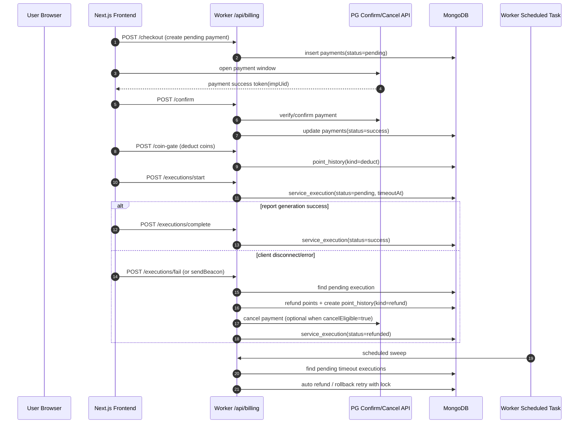

# Payment Auto Refund And Rollback

## 1. Data Flow

## 2. Mongoose Schema (Summary)

- collection: `serviceexecutiontransactions`
- key fields:
  - `status`: `pending | success | failed | refunded | cancelled`
  - `executionKey`: per-user idempotency key
  - `timeoutAt`: pending timeout detection
  - `nextRetryAt`, `retryCount`, `maxRetries`: async retry control
  - `lock.token`, `lock.until`: cleanup worker lock
  - `sourceTransactionId`: coin deduction history id for rollback
  - `paymentRef`: optional PG cancel reference
  - `retentionUntil`: TTL cleanup

## 3. Backend APIs

- `POST /api/billing/executions/start`
  - create pending service execution row (idempotent by userId + executionKey)
- `POST /api/billing/executions/heartbeat`
  - extend `timeoutAt` while long running work is in progress
- `POST /api/billing/executions/complete`
  - mark success and release lock state
- `POST /api/billing/executions/fail`
  - attempt immediate compensation (refund/cancel) and mark refunded/failed

## 4. Automatic Cleanup Worker

- scheduled task: `runServiceExecutionTimeoutTask`
- behavior:
  - lock one pending timeout row at a time (`findOneAndUpdate` lock)
  - run compensation
  - on transient failure, backoff retry by `nextRetryAt`
  - stop retries at `maxRetries` and mark `failed`

## 5. Frontend Guard

- hook: `useServiceExecutionGuard`
- behaviors:
  - heartbeat every N seconds
  - `beforeunload` sendBeacon fail report
  - optional `visibilitychange` fail signal
  - explicit `markCompleted()` to suppress disconnect fail
