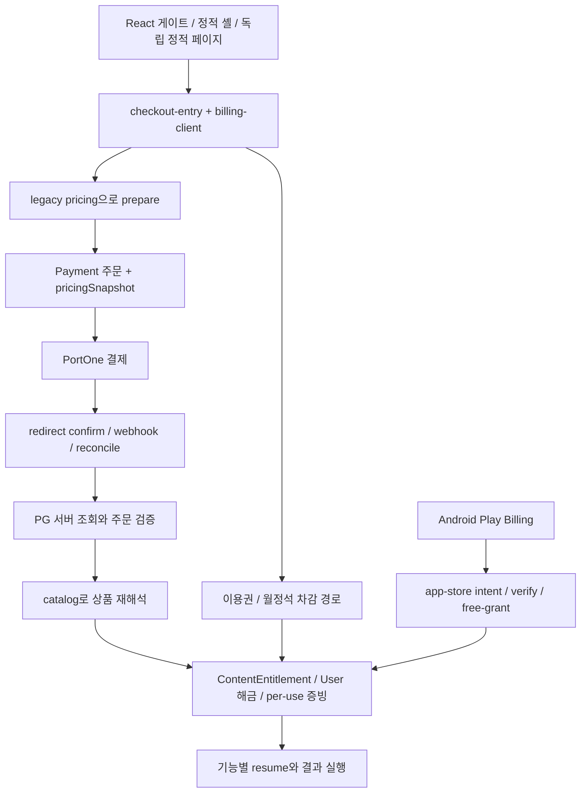
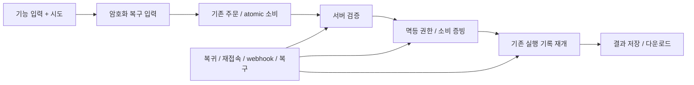

# 결제 안정화 실행 기록

2026-09-08. **Phase 1 검토와 P0 안정화 진행 중. 전수 E2E 완료 보고가 아니다.**

## 1. 발견된 유료 기능 총 개수

최종 서비스 개수는 미확정이다. `payment-inventory.json`은 Git 추적 실행 소스에서 추출한 상품·변형·진입 근거를 보존한다. 현재 서버 정규 가격 키 146개, 실제 manifest 확장 후 고유 음원 상품 123개다. 기본 가격이 없는 `coin-gate-per-use` 컨테이너를 제외하고 가격 변형·generic reason·이용권·Play SKU를 합하면 305행이다. 상품 행을 서비스 개수로 합산하지 않는다.

`payment-inventory.md`는 모든 상품 행의 검증표이며, JSON에는 요청된 상세 열과 source hash/행번호가 있다. `UNVERIFIED`는 조사 미완료, `UNTESTED`는 기기/결과 검증 미실행이다. 이름 일치·가격 해석 성공을 실행 경로 확인으로 간주하지 않는다.

## 2. 기존 결제 구조



최신 main에는 `worker/payments/resume-context.js`의 서버 암호화 저장, `GET /orders/:id/resume`, 동일 소비 marker 재시도 처리가 이미 있다. 기존 조사 기준 브랜치에 없었던 변경이므로 보존한다. 현재 저장은 주문 metadata에 붙고 원래 route 문자열의 형식만 검사한다. 별도 TTL 저장소·기능별 route 허용 목록·결과 저장 즉시 삭제·모든 입력 복원 계약은 추가 추적 대상이다.

## 3. 발견된 P0와 이번 수정

- **prepare→grant 해석 일치:** 음원 123개는 공용 music policy로 동적 catalog 해석을 추가했다. generic reason 7개는 주문 `pricingSnapshot.reason`을 저장·복원하도록 연결했다. 네빌·코스믹 소울·요가의 reason 변형 가격도 같은 reason으로 재해석한다. Inventory의 지급 실패와 가격 차이는 모두 0이다.
- **이용권 잔여 0 정책:** `isPassBudgetExhausted`는 잔여 0에서만 true다. 소진 감사 필드는 등급·만료일·프로필 상한을 바꾸지 않으며, v2·레거시 응답은 `passBudgetExhausted`로 잔여 0만 알린다. 새 이용권 활성화 시 감사 마커를 지운다.
- **음원 이용권 다운로드:** 서버가 허용한 단건·월정석·이용권 라이선스 모두 다운로드 가능하다. 클라이언트의 다운로드 전용 이용권 제외 옵션을 제거했고, 동일 곡 재다운로드는 기존 권한 판정을 재사용한다. Android 무료 정책은 바꾸지 않았다.
- **1,000원 탐색 분류:** `무료 재생 · 다운로드 1,000원`을 무료 전용이 아니라 `free`와 `low` 양쪽 버킷으로 분류한다. 홈 레지스트리의 음원 표시 가격을 이 형식으로 명시했다.

## 4. 수정된 architecture

결제 준비와 지급이 동일한 `productId`·`featureKey`·`reason`을 사용하도록 주문 스냅샷 계약을 확장했다. 음원 상품은 manifest 파생 키를 공용 policy로 해석하며, 이용권 소진은 계약 종료와 분리된 예산 상태가 됐다.

현재 목표 구조:



## 5. 모바일 결제 개선

음원 다운로드 결제창은 이용권 선택을 다시 허용하고 서버 라이선스와 같은 판정을 사용한다. 그 밖의 `checkout-entry.js`, `billing-client.ts`, `usePaidResume.ts`, 이미지 입력 화면 및 정적 action의 durable resume 전수 연결은 계속 검토해야 한다. 원본 이미지 서버 보관 금지, 최소 입력 암호화 최대 7일, 완료 시 삭제, 재첨부 시 재결제 금지 정책을 유지한다.

## 6. RESUME 적용 기능

이번 변경으로 새롭게 적용한 기능은 없다. 전체 후보 목록은 Inventory에 남겼다. 기존 wiring 검사의 통과 수를 모든 기능의 durable resume 성공 수로 바꾸어 보고하지 않는다.

## 7. MongoDB 최적화

실제 DB 접속·인덱스 생성·운영 데이터 변경 없음. 모델 선언과 query pattern의 대조, 실제 index 확인, 과거 조기 종료 복원 dry-run 설계가 남아 있다. 새 소진은 원래 만료일까지 등급·만료일·프로필 상한을 유지하며, 과거 복원 시 사용량·한도를 새로 지급하지 않는다.

## 8. Cloudflare 최적화

변경 없음. `credential-scoped-cache.js`의 인증/계정 캐시와 Cache API·Service Worker를 추가 검사해야 한다. no-store 응답 헤더 확인만으로 Worker 내부 캐시가 없다고 판정하지 않는다.

## 9. 삭제한 중복 코드

없음. Inventory는 동일 바이트의 public 사본만 source mirror로 연결한다. 이름이 같아도 내용이 다르면 독립 조사 대상으로 보존한다. 실제 코드의 삭제/통합은 아직 하지 않았다.

## 10. 테스트 결과

- 최신 main 기반 결제 v2 mock: 26 suites / 377 tests PASS.
- Inventory 회귀: native/public 포함, HTML 주석/JSON-LD 분리, 파싱 실패, 미러 변조, 실제 manifest 확장, 외부 import 거부, 미검토 게이트, stale review 검사, UI 헬퍼의 요청 경계 오탐 제외.
- Inventory 테스트 10개 PASS. 실행 소스 2,164개, 결제 신호가 있는 route 후보 30개, JS 파싱 오류 0개. 호출 후보를 실제 결제 action+domain 경계로 좁혀 미검토 상품/source/call 항목은 10,135개에서 1,218개로 줄었다. 검토를 자동 승인하지 않았다.
- 결제 P0 mock: 음악·catalog·generic reason·이용권 잔여 0·클라이언트 snapshot 대상 테스트 PASS. 실제 결제는 실행하지 않았다.
- critical `npm run check:fast` PASS: Node 940/940, Jest 2,427/2,427, 결제 정적 가드와 Worker dry-run 빌드 포함.
- 전체 기능의 Desktop/Android/iPhone/Reload/Result 결과는 `payment-inventory.md`의 305행에 모두 UNTESTED로 기록한다.
- 실제 결제·운영 DB·실 LLM·staging/실기기 검증 미실행. 성능 전후 비교는 미측정.

## 11. 남은 위험과 다음 단계

Phase 1의 미분류 0개 조건은 아직 충족되지 않았다. 다만 순수 함수로 재현된 prepare→grant P0, 승인된 이용권 0원 정책, 음원 이용권 다운로드, 1,000원 탐색 분류는 회귀 테스트와 함께 적용했다.

다음 검토는 Inventory의 source → import/호출자 → route → prepare → grant → 실제 entitlement reader → result 저장을 연결한다. 모든 keyword hit를 유료 진입점으로 세지 말고, core/consumer/supporting/non-payment 역할을 근거로 분류한다. source 검토에는 모든 후보 call의 행번호·이유가 필요하다. 상품 검토에는 모든 상세 열과 source hash/행 근거가 필요하다.

`docs/payments/payment-inventory-reviews.json`에 `sources`/`products` 객체로 검토를 추가할 수 있다. source 키는 경로이고 값은 `sha256`(source의 LF 정규화 `reviewSha256`), `role`, `rationale`, `calls:[{name,line,rationale}]`이다. product 키는 Inventory id이고 값은 `fingerprint`, `rationale`, `evidence:[{file,sha256,line}]`, `details`다. `details`에는 displayName/routes/frontendTypes/pass/moonstone/pg/kakaoPay/paymentStart/paymentApis/returnDestinations/resume/entitlementStorage/resultTiming/recovery가 필요하다. 해당 없는 항목은 근거 있는 N/A로 작성한다. 코드 hash가 달라지면 검토를 다시 해야 한다. 이 검토는 기기 E2E 증거를 대신하지 않는다.

```sh
node --require ./scripts/lib/mock-network-guard.cjs scripts/payment-inventory.mjs --write --check
node --require ./scripts/lib/mock-network-guard.cjs --test __tests__/release/payment-inventory.test.js
npm run test:jest -- --runInBand --testPathPatterns=payments-v2 --silent
npm run check:fast
```

추출 CLI 자체는 로컬 파일만 읽고 `--write`에서 문서만 쓴다. 현재 `--check` 실패는 조사 미완료를 드러내는 계약이다. CI 필수 게이트 연결은 아직 하지 않았으며, 연결 완료로 보고하지 않는다.

운영 반영·과거 데이터 복원 적용은 하지 않았다. 롤백 시 승인 주문·권한·소비 증빙을 삭제하지 않는다. Inventory 검토·durable resume·운영 환경 검증이 남아 있어 PR은 draft로 유지한다.


## 2026-09-08 후속 검토: 복구·캐시·재구매

최신 main `8cc8d24b7`에서 `codex/payment-stabilization-review`로 계속했다. 기존 `payment-inventory-phase1`의 인계 커밋은 보존했다.

- **접근 캐시 범위:** 회당 결제 A의 허용 캐시가 미결제 B를 통과시키고, 무증빙 호출의 거절 캐시가 결제 완료 복구를 막는 두 방향을 mock으로 재현했다. 캐시를 요청·프로필로 분리했다. 동일 요청은 기존 3초 캐시를 재사용하고 사용자 prefix 무효화는 유지한다.
- **암호문 binding:** 저장된 binding만 믿지 않고 주문의 사용자·요청·상품과 대조한다. 이용권의 기존 재구매 세대 키도 허용하며 소유자/요청/상품이 달라지면 복구 입력을 반환하지 않는다.
- **환불 후 재구매:** 기존 구현은 REFUNDED를 ACTIVE로만 바꿔 `alreadyOwned=true`와 이전 주문번호를 남겼다. 환불된 행에만 CAS를 적용해 새 주문·결제수단·가격·지급시각으로 전환한다. 활성 권한 재생은 최초 주문을 보존하고 이전 주문의 환불 재생은 새 권한을 회수하지 않는다. 주문 이력은 Payment에 남긴다.
- **음원 검토:** manifest의 고유 음원 123개를 공용 플레이어 → 게이트 → catalog/지급 → 접근 reader → 다운로드 경로로 검토했다. 4개 source 및 2개 call 근거도 hash에 고정했다. 현재 미검토는 재추출 기준 1,220 → 1,091개이며 Phase 1은 아직 실패한다. 상품 검토는 실제 기기/PG/E2E 성공을 뜻하지 않는다.
- **TTL 사실 정정:** `worker/payments/reconcile.js`에 7일 초과 payload 제거가 이미 구현돼 있다. 주문 자체는 삭제하지 않는다. 별도 TTL collection, 결과 저장 완료 즉시 입력 제거, 전체 기능 복구 계약 검토는 남아 있다.

검증: 결제 v2 26 suites / 389 tests PASS, 접근 캐시 10 tests PASS, 서버 복구 7 tests PASS. 전체 `check:fast` 결과는 최신 인계 문서 참조. 실결제·실 LLM·운영 DB 변경은 실행하지 않았다. 가격·이용권/월정석/단건 선택 정책·인증·API 응답 구조·DB 스키마는 유지했다.

롤백은 이번 코드 변경을 되돌리는 PR로 수행한다. 주문·권한·사용량 기록을 삭제하거나 예산을 다시 지급하지 않는다. 실제 PG/실기기 증거, 미검토 1,091개, 과거 조기 종료 read-only 후보 보고, 성능 비교가 남아 있다.

검토 hash는 LF 정규화한 `reviewSha256`를 쓴다. 원본 `sha256`는 정확한 바이트 미러 판정용으로 유지한다. Windows/CI 줄바꿈 차이는 검토를 무효화하지 않지만 실제 코드 차이는 무효화한다. Inventory 회귀 11 tests PASS.
