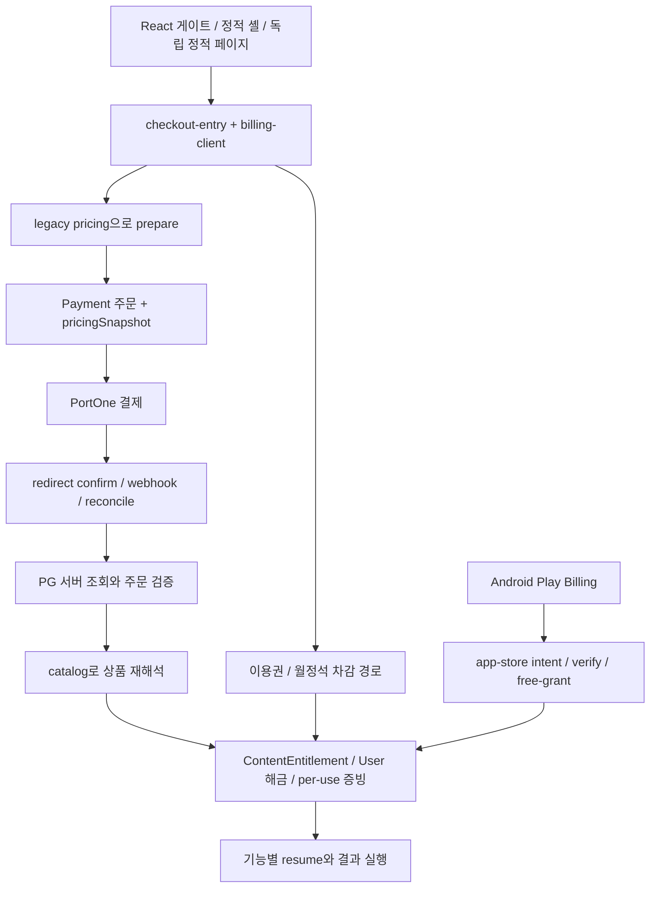
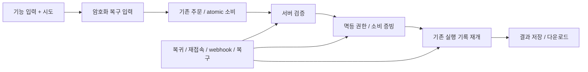

# 결제 안정화 실행 기록

2026-09-08. **Phase 1 진행 중. 서비스 정책 변경·전수 E2E 완료 보고가 아니다.**

## 1. 발견된 유료 기능 총 개수

최종 서비스 개수는 미확정이다. `payment-inventory.json`은 Git 추적 실행 소스에서 추출한 상품·변형·진입 근거를 보존한다. 현재 서버 정규 가격 키 146개, 실제 manifest 확장 후 고유 음원 상품 123개다. 가격 변형·generic reason·이용권·Play SKU를 합하면 306행이다. 상품 행을 서비스 개수로 합산하지 않는다.

`payment-inventory.md`는 모든 상품 행의 검증표이며, JSON에는 요청된 상세 열과 source hash/행번호가 있다. `UNVERIFIED`는 조사 미완료, `UNTESTED`는 기기/결과 검증 미실행이다. 이름 일치·가격 해석 성공을 실행 경로 확인으로 간주하지 않는다.

## 2. 기존 결제 구조



최신 main에는 `worker/payments/resume-context.js`의 서버 암호화 저장, `GET /orders/:id/resume`, 동일 소비 marker 재시도 처리가 이미 있다. 기존 조사 기준 브랜치에 없었던 변경이므로 보존한다. 현재 저장은 주문 metadata에 붙고 원래 route 문자열의 형식만 검사한다. 별도 TTL 저장소·기능별 route 허용 목록·결과 저장 즉시 삭제·모든 입력 복원 계약은 추가 추적 대상이다.

## 3. 발견된 P0 후보

- **음원 지급 catalog 누락:** 실제 manifest의 123개 키 모두 `resolveLegacyProduct`에서 1,000원으로 준비되지만 `grantOrderEntitlement`가 호출하는 `resolveProduct`에서 `PRODUCT_NOT_FOUND`다. DB/PG 없는 순수 함수 재현이다. 실제 과금은 실행하지 않았다.
- **generic reason 7개 지급 해석 실패:** 인생의 책 관련 3개, 숙요점 유명인 궁합, 신년운세 PDF, 신년운세 AI, 운명의 업은 generic key로 준비할 때 지급 해석이 실패한다. 실제 활성 프론트가 정규 키를 보내는지 호출부 대조가 필요하다. 7개의 운영 장애로 확정하지 않는다.
- **금액 변형 3개:** 네빌 60분·코스믹 소울 30분·요가 60분의 준비가와 지급 catalog 기본가가 다르다. PG 검증은 주문 snapshot을 사용하므로 이 차이만으로 금액 검증 취약점이라고 단정하지 않는다.
- **이용권 조기 종료:** `worker/lib/profile-limits.js:isPassBudgetExhausted`는 최저 30 내부 단위 미만을 소진으로 처리한다. `buildPassTerminationFields`가 등급과 만료일을 변경한다. 승인된 새 정책과 불일치하며 v2, 레거시, 프론트 snapshot을 함께 수정해야 한다.

## 4. 수정된 architecture

이번 단계는 조사 도구·검증 자료만 추가했다. 서비스 실행 architecture는 아직 변경하지 않았다.

다음 단계의 확정 목표:



## 5. 모바일 결제 개선

미구현. `checkout-entry.js`, `billing-client.ts`, `usePaidResume.ts`, 현재 서버 resume, 이미지 입력 화면 및 정적 action의 호출 연결을 검토해야 한다. 원본 이미지 서버 보관 금지, 최소 입력 암호화 최대 7일, 완료 시 삭제, 재첨부 시 재결제 금지 정책을 유지한다.

## 6. RESUME 적용 기능

이번 변경으로 새롭게 적용한 기능은 없다. 전체 후보 목록은 Inventory에 남겼다. 기존 wiring 검사의 통과 수를 모든 기능의 durable resume 성공 수로 바꾸어 보고하지 않는다.

## 7. MongoDB 최적화

실제 DB 접속·인덱스 생성·운영 데이터 변경 없음. 모델 선언과 query pattern의 대조, 실제 index 확인, 과거 조기 종료 복원 dry-run 설계가 남아 있다. 0원 이용권은 원래 만료일까지 프로필 상한만 유지하며, 복원 시 사용량·한도를 새로 지급하지 않는다.

## 8. Cloudflare 최적화

변경 없음. `credential-scoped-cache.js`의 인증/계정 캐시와 Cache API·Service Worker를 추가 검사해야 한다. no-store 응답 헤더 확인만으로 Worker 내부 캐시가 없다고 판정하지 않는다.

## 9. 삭제한 중복 코드

없음. Inventory는 동일 바이트의 public 사본만 source mirror로 연결한다. 이름이 같아도 내용이 다르면 독립 조사 대상으로 보존한다. 실제 코드의 삭제/통합은 아직 하지 않았다.

## 10. 테스트 결과

- 최신 main 기반 결제 v2 mock: 26 suites / 377 tests PASS.
- Inventory 회귀: native/public 포함, HTML 주석/JSON-LD 분리, 파싱 실패, 미러 변조, 실제 manifest 확장, 외부 import 거부, 미검토 게이트, stale review 검사.
- Inventory 테스트 9개 PASS. 실행 소스 2,164개, 근거/route가 있는 파일 1,080개, JS 파싱 오류 0개. 미검토 상품/source/call 항목 10,134개이며 호출/파일 중복을 포함한다.
- `check:fast`: lint·typecheck를 거쳐 Node 테스트에서 중단. 934개 중 933 PASS / 1 FAIL. 변경하지 않은 `public/icons/yehwa-branch.svg`의 CRLF 체크아웃과 생성기의 LF 바이트 비교가 실패했다. 해당 소스/생성기는 HEAD 대비 diff가 없다. 뒤에 배치된 Worker build·전체 Jest 등은 이 실행에서 수행되지 않았다.
- 전체 기능의 Desktop/Android/iPhone/Reload/Result 결과는 `payment-inventory.md`의 306행에 모두 UNTESTED로 기록한다.
- 실제 결제·운영 DB·실 LLM·staging/실기기 검증 미실행. 성능 전후 비교는 미측정.

## 11. 남은 위험과 다음 단계

Phase 1의 미분류 0개 조건이 아직 충족되지 않았다. 이에 따라 Phase 2 이후 정책·결제 코드는 수정하지 않았다. 특히 1,000원 필터·음원 이용권 사용·0원 소진 정책은 아직 서비스에 적용되지 않았다.

다음 검토는 Inventory의 source → import/호출자 → route → prepare → grant → 실제 entitlement reader → result 저장을 연결한다. 모든 keyword hit를 유료 진입점으로 세지 말고, core/consumer/supporting/non-payment 역할을 근거로 분류한다. source 검토에는 모든 후보 call의 행번호·이유가 필요하다. 상품 검토에는 모든 상세 열과 source hash/행 근거가 필요하다.

`docs/payments/payment-inventory-reviews.json`에 `sources`/`products` 객체로 검토를 추가할 수 있다. source 키는 경로이고 값은 `sha256`, `role`, `rationale`, `calls:[{name,line,rationale}]`이다. product 키는 Inventory id이고 값은 `fingerprint`, `rationale`, `evidence:[{file,sha256,line}]`, `details`다. `details`에는 displayName/routes/frontendTypes/pass/moonstone/pg/kakaoPay/paymentStart/paymentApis/returnDestinations/resume/entitlementStorage/resultTiming/recovery가 필요하다. 해당 없는 항목은 근거 있는 N/A로 작성한다. 코드 hash가 달라지면 검토를 다시 해야 한다. 이 검토는 기기 E2E 증거를 대신하지 않는다.

```sh
node --require ./scripts/lib/mock-network-guard.cjs scripts/payment-inventory.mjs --write --check
node --require ./scripts/lib/mock-network-guard.cjs --test __tests__/release/payment-inventory.test.js
npm run test:jest -- --runInBand --testPathPatterns=payments-v2 --silent
npm run check:fast
```

추출 CLI 자체는 로컬 파일만 읽고 `--write`에서 문서만 쓴다. 현재 `--check` 실패는 조사 미완료를 드러내는 계약이다. CI 필수 게이트 연결은 아직 하지 않았으며, 연결 완료로 보고하지 않는다.

운영 반영·데이터 복원 적용은 별도 명시 요청 이후다. 롤백 시 승인 주문·권한·소비 증빙을 삭제하지 않는다. PR은 조사 중 draft로 유지하고 사용자 머지 정책을 따른다.
