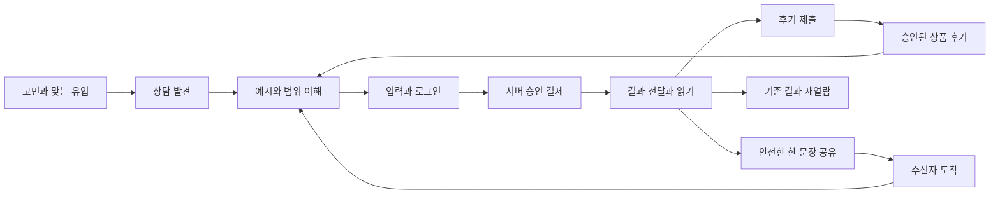

# Code Destiny 구매 전환과 후기 공유 개선 보고서

작성일: 2026-10-07 KST. 대상: 꿀꿀운세 홈, 영냥이, 연이의 운명 찻집, 네오의 팩폭 전략실, 공통 후기·공유·계측. 구현 작업 목록은 [세션별 실행 명세](conversion-sessions-2026-10-07.md), 재개 입구는 [인수인계](../handoff/conversion-growth-2026-10-07.md)다.

## 1. 가장 먼저 바꿔야 할 것

**상담 품질을 더 높이는 작업과 별도로, 좋은 상담을 구매 전에 이해하고 구매 후 다른 사람에게 설명하기 쉽게 만들어야 한다.** 현재 가장 유력한 병목은 기능 부족보다 연결의 마찰이다. 구매 전 예시, 고민별 추천, 후기 초대, 후기 보상, 공개 공유 카드, 결과 복구와 구매 계측이 이미 있다. 이것들을 또 만드는 대신, 발견 위치·선택의 일관성·작성 부담·공유 목적·측정 가능성을 개선해야 한다.

사용자가 말한 “이용한 사람들의 평판은 좋다”를 출발점으로, **콘텐츠 품질을 최상위 강점으로 두는 전략**을 채택한다. 경쟁사 유료 결과를 동일 조건으로 비교 평가한 순위는 아니다. 만족한 고객만 운영자에게 말했을 가능성도 있으므로 이탈자·불만족자의 경험을 함께 확인해야 한다. 외부 광고에 “품질 1위”라고 쓰는 근거로 이 보고서를 사용하지 않는다.

우선순위는 다음과 같다.

1. **어디에서 멈추는지 확인:** 기존 계측에 최근 운영 수치를 채우고 후기·공유의 누락 단계를 보완한다.
2. **선택한 상담이 다음 화면에 이어지게:** 영냥이 상세의 생선 선택과 질문 범위 추천 사이의 약속을 맞춘다.
3. **만족을 기록하기 쉽게:** 현재 상품을 유지한 후기 진입, 120자 공유 카드의 입력·검증 불일치를 먼저 해결한다.
4. **상세페이지를 구매 판단 순서로:** 내 고민 → 받는 답의 예시 → 범위와 가격 → 관련 후기 → 준비할 정보 → 시작하기.
5. **대표 경로에서 속도·조작·복귀 검증:** 홈 점수 하나보다 실제 구매와 결과 읽기 여정을 개선한다.

공감 문장은 결과의 만족을 강화한다. 그러나 상품을 못 고르거나 가격·범위를 이해하지 못해 이탈한 방문자에게는 도달하지 않는다. 다른 세션의 공감 문장 작업을 반복하지 않고 그 앞뒤 여정을 담당한다.

## 2. 근거와 진단 범위

| 표기 | 의미 | 이번에 확인한 범위 |
|---|---|---|
| 공개 화면 | 로그인 없이 실제 페이지에서 관찰 | 꿀꿀운세 홈, 영냥이 홈, 찻집, 사주아이 홈·로그인 전후 진입, 청월당 랜딩 첫 화면 |
| 코드 확인 | 현재 구현·분기·이벤트를 정적으로 추적 | 구매 설명, 질문 범위, 후기, 공유, 분석 및 성능 도구 |
| mock 검증 | 외부 거래 없이 로컬 검사 | 구매 계측 9개 테스트, 기존 분석 이벤트 검사 |
| 가설 | 개선 효과나 고객의 심리 추론 | 선택 부담, 가격 인지, 후기 작성 부담, 사생활 노출 우려 |
| 미측정 | 수치 또는 조건이 확보되지 않음 | 최근 방문·구매·매출·후기율·실제 공유 수신율, 운영 CWV, 실기기, 실결제, 경쟁 유료 결과 |

소스 근거 기준은 `e8513e1f99cc45f97b42e68a4dde2634ea1097d9`다. 조사 중 다른 세션의 `3a05d8319c5017b10bbed3b587a5e7b831a3b940` 공감 문장 커밋이 main에 생겨 문서 작성은 공식 스크립트의 격리 워크트리에서 진행했다. 줄 번호는 탐색 출발점이며 실행 세션에서 심볼을 다시 확인한다. 공개 화면의 배포 SHA와 로컬 SHA가 같다는 검증은 하지 않았다.

모바일 홈은 인앱 브라우저 390×844 CSS px에서 확인했다. `#cdConcernPick` 시작 위치는 문서 상단에서 약 **2,341px**였다. 단일 비로그인 관찰이며 모든 기기·캐시·개인화 상태를 대표하지 않는다. 이 측정은 “고민 추천이 없다”가 아니라 “있지만 첫 화면과 거리가 있다”는 근거다. 실제 도달률은 별도 계측이 필요하다.

이 작업은 보고서 제작이다. 제품 UI·프롬프트·가격·결제·인증·API·DB를 수정하지 않았다. 운영 분석 데이터나 고객 원문을 추출하지 않았고, 공개 리뷰를 제출하거나 공유 링크를 발행하지 않았다.

## 3. 경쟁 서비스에서 배울 점

비교 대상은 공개 구매 전 경험과 공식 설명이다. 경쟁사의 매출·전환율·후기 진위·광고 효율·해석 정확도를 확인한 것은 아니다. 앱스토어 다운로드, 채널 규모, 공개 후기 노출은 도달·신뢰 표현의 지표이며 높은 구매 전환율의 증명은 아니다.

| 서비스 | 확인한 공개 구조 | Code Destiny가 가져올 원리 | 그대로 따라 하지 않을 것 |
|---|---|---|---|
| 사주아이 | 홈 상품명에 시작 가격을 드러내고 짧은 사용 목적을 붙인다. 무료 일일 경험, 눈에 띄는 후기, 가격·자동결제·시간 모름에 관한 FAQ가 있다. 공식 카카오 채널은 선물하기 진입도 안내한다. | 처음 온 사람이 비용과 첫 선택을 빨리 이해하게 한다. 결과 뒤 추가 탐색과 재방문의 이유를 연결한다. | 가격을 990원으로 맞추거나 새로운 결제 재화를 도입하는 것. 동의 없는 메시지·선물·초대 정책 신설. |
| 점신 | 공식 Play 설명에서 매일의 운세 보고서, 관계 관리, 전문가 상담, 광고와 행운패스, 알림 활용을 제시한다. Play 페이지는 500만+ 다운로드를 표시한다. | 다시 올 이유와 첫 구매의 이유를 구분한다. 오늘 할 작은 행동과 이미 받은 결과의 재열람을 연결한다. | 광고·보상 장치를 늘리는 것만으로 충성도가 생긴다는 가정. 무료/광고 모델을 유료 상담과 같은 전환율로 비교. |
| 청월당 | 홈을 연애·재회 등 고민과 캐릭터 상품으로 묶는다. 리뷰 페이지에서 상품별 탐색, 날짜, 구매 횟수 표시를 확인했다. 재회 상품에는 별도 이미지 중심 랜딩이 있다. | “나와 비슷한 고민으로 이 상품을 이용한 사람”의 증거를 결정 가까이에 놓는다. 유입 소재와 도착 상품을 일치시킨다. | 자극적인 공포·단정·과장 표현, 상품 품질 순위 주장, 후기 숫자나 실시간 표기 조작. 긴 이미지 랜딩의 접근성까지 모방. |
| Code Destiny | 세계관·상담가 차이, 실제 계산 근거, 질문별 안내, 구매 전 예시와 후기, 여러 결제 수단, 결과 복구·보관·공유 기반이 있다. | 품질을 “읽을 수 있는 증거”와 “다음 행동의 명료함”으로 바꾸면 기존 자산을 활용할 수 있다. | 기능·캐릭터·체계를 더 늘려 첫 선택의 부담을 키우는 것. |

근거: [사주아이 홈과 FAQ](https://saju-kid.com/), [사주아이 공식 채널](https://pf.kakao.com/_kZDkn), [점신 공식 Play 등록](https://play.google.com/store/apps/details?hl=ko&id=handasoft.mobile.divination), [청월당 홈](https://cheongwoldang.com/), [청월당 상품별 리뷰](https://cheongwoldang.com/reviews), [청월당 재회 랜딩](https://cheongwoldang.com/landing/loveagain25). 확인일 2026-10-07. 경쟁사 문구는 기능 구조를 요약했으며 고객 후기 원문을 재사용하지 않는다.

**시사점:** 사주아이는 첫 선택을 가볍게 설명하고, 점신은 반복 방문의 이유를 제공하며, 청월당은 고민과 상품·후기를 가까이 둔다. Code Destiny는 상담 품질을 낮추거나 가격을 따라갈 필요 없이 세 원리를 적용할 수 있다. 이는 공개 구조에서 얻은 추론이며 성과 보장은 아니다.

## 4. SWOT와 실행 전략

| 구분 | 분석 | 실행으로 연결 |
|---|---|---|
| 강점 S1 | 상담 품질·구체성·근거 설명을 최상위 경쟁력으로 둔다는 전략 전제 | 실제 결과 형식과 근거 설명을 구매 전에 읽을 수 있게 한다. “최고” 대신 사용자가 판단할 자료를 제공한다. |
| 강점 S2 | 연이·네오·영냥이의 목소리와 세계관, 여러 체계, 작성자의 상담 경험 | 동일 UI 틀 안에서도 목적·말투를 구분하고 각 결과의 본래 표현을 보존한다. |
| 강점 S3 | 예시·후기·공유·복구·구매 검증이 이미 구현됨 | 대규모 재개발보다 연결·노출·일관성의 작은 개선이 가능하다. |
| 약점 W1 | 전문 체계·캐릭터·생선 범위·결제 수단을 함께 이해해야 하는 첫 선택 | 고민 하나로 시작해 적합한 상담 하나와 대안 하나를 제안한다. 전체 기능은 계속 탐색 가능하게 둔다. |
| 약점 W2 | 선택 생선과 질문 추천의 연결, 직접 랜딩과 공통 상세의 정보 차이 | 진입 경로와 관계없이 상품·가격·범위의 설명을 유지한다. |
| 약점 W3 | 후기에서 현재 상품 맥락이 사라지고 공유 문장 편집 부담이 있음 | 만족 직후 작게 행동할 수 있게 연결한다. 보상 확대보다 마찰 제거를 먼저 한다. |
| 약점 W4 | 현행 퍼널 기준선 미확보, 후기·공유 일부 단계 계측 공백 | 모수와 이탈을 확인한 뒤 실험한다. “구매 0”과 “계측 0”을 구분한다. |
| 기회 O1 | 긴 고민을 정리해 주는 상담 가치의 가시화 | 연애·일 등 한 주제의 대표 상세를 먼저 완성하고 효과가 확인되면 확장한다. |
| 기회 O2 | 사적인 상담과 가벼운 공유 사이의 차이 | 원문 대신 사용자가 고른 안전한 한 문장·행동 카드를 공유하도록 돕는다. |
| 기회 O3 | 상품별 후기와 검색·SNS 유입의 연결 | 유입 질문과 같은 질문의 예시·후기·CTA를 보여준다. 승인된 실제 후기만 쓴다. |
| 위협 T1 | 무료/저가 운세가 만드는 낮은 가격 기준과 높은 익숙함 | 분량 경쟁보다 “내 질문에 답·근거·실행 방향을 받는다”는 가치를 설명한다. |
| 위협 T2 | 운세를 공유하면 사적인 고민이 드러난다는 심리적 부담 | 공유 전에 공개 내용을 확실히 보여주고 원문·출생정보 자동 포함을 금지한다. |
| 위협 T3 | 여러 세션이 동시에 문구·위치·가격·계측을 바꾸는 운영 방식 | 파일 소유와 실험 기간을 분리한다. 기능 통합과 운영 효과 측정을 다른 완료 상태로 둔다. |
| 위협 T4 | 생성 지연·오류·구매 기록 혼동 한 번이 만드는 신뢰 손실 | 기다림·복귀·재열람·문의 동선을 구매 전후에서 일관되게 안내한다. |

SO 전략은 강한 결과를 작은 예시와 관련 후기로 보여주는 것이다. WO 전략은 질문 중심 진입과 행동 맥락 보존이다. ST 전략은 프라이버시와 저장된 유료 결과의 신뢰를 차별점으로 삼는 것이다. WT 전략은 가격 실험이나 기능 확장 전에 측정·복귀·오류 경로를 정리하는 것이다.

## 5. 구매에서 추천까지의 여정 진단

### 발견과 선택

홈의 첫 화면은 캐릭터와 “운세 골라보기”를 먼저 보여준다. 이어지는 체계별 바로가기·탐색·캐릭터 포털·작성자 소개 후에 고민별 추천이 나온다. 캐릭터 자산을 없애기보다 처음 온 사람이 “내 상황에서 무엇부터 볼까”를 첫 흐름에서 고를 수 있게 실험한다. 로그인·모든 운세·기록 등 기존 접근은 유지한다.

광고나 SNS에서 재회·이직 고민을 보고 들어온 사용자에게 다시 여섯 체계를 고르게 하면 유입 때 생긴 기대를 잃을 수 있다. 새 서비스나 라우트를 대량 신설하기 전에 기존 질문 안내와 대표 상세에 직접 연결한다. 게시물·광고 유입과 검색·직접 방문을 구분해 평가한다.

### 상세페이지와 가격 이해

영냥이에는 이미 펼쳐진 편집 예시, 참치 사주 이메일 후기 원문, 가격·챕터 안내가 있다. 문제는 범위 비교 위치의 공통 분석 설명이 동일하게 표시되는 부분과 선택한 구성이 다음 질문 추천 화면에서 다시 정해질 수 있는 부분이다. 가격·챕터까지 같다는 뜻은 아니다. 기본 답변의 품질은 공통으로 유지하면서 질문 범위·판단 대상·기간·추가 질문 권한을 설명해야 한다.

네오는 공통 상세 경유와 직접 랜딩의 정보가 다르다. 초기 소개에서도 기존 가격 조회 결과와 예시를 이해할 수 있게 한다. 찻집은 스토리 진입이 첫 주 행동이다. 상담을 원하는 방문자에게 질문 진입을 먼저 제안하되 프롤로그·찻잔 의식·달빛 분위기는 계속 선택할 수 있어야 한다.

### 입력과 로그인

영냥이 질문 폼은 질문, 주제, 판단 대상, 흐름, 상황, 기간, 체계를 함께 다룬다. 정보가 계산·범위 판정에 필요하다는 것과 한 화면에 모두 보여야 한다는 것은 다르다. 질문을 먼저 받고 부족한 조건만 다음에 묻는 구조를 검토한다. 필수 근거를 삭제하거나 무리하게 추정해서 채우지 않는다.

찻집 타로는 카드 준비를 눌러야 로그인 필요 오류가 드러나는 흐름이 있다. 로그인 복귀의 초안 복원은 이미 존재하므로 새 저장 구조보다 “다음 단계에 왜 로그인이 필요한지”를 사전에 알려주는 것이 우선이다. 결제 취소·뒤로가기·새로고침에서 질문과 고정 카드가 유지되는지 mock으로 검증한다.

### 결과 읽기와 재방문

읽을 내용이 풍부한 강점이 모바일에서 읽기 부담이 되지 않도록 한 줄 답, 근거, 생활 패턴, 행동 조언, 목차의 관계를 점검한다. 결과의 원문·챕터를 다른 일반 템플릿으로 덮어쓰지 않는다. 각 운세의 본래 결과 UI를 재사용한다.

후기 요청을 결제 직후 또는 결과를 읽기도 전에 강하게 띄우지 않는다. 핵심 답·행동 조언을 접한 뒤 자연스럽게 초대하고, 지금 쓰지 않아도 유료 결과 재열람에서 다시 찾을 수 있게 한다. 7일 뒤 행동을 돌아보는 진입은 재방문 가설이며, 자동 메일·푸시는 기존 동의와 운영 정책을 확인한 후 별도 작업으로 결정한다.

### 후기와 공유는 서로 다른 행동이다

후기는 다음 구매자의 판단을 돕는 기록이다. 공유는 친구에게 보낼 만한 이유가 있어야 하는 대화다. “좋았다”는 감정만으로 둘 다 자동 발생하지 않는다.

| 행동 | 부담 가설 | 개선 방향 |
|---|---|---|
| 후기 | 다시 로그인·상품 선택·작문, 공개될 정보가 불명확 | 현재 상품 연결, 중립적인 질문 한두 개, 입력·승인 상태 안내 |
| 공유 | 사적인 질문 노출, 긴 문장 편집, 친구가 링크에서 무엇을 보는지 모름 | 선택한 한 문장 미리보기, 짧은 후보, 공개 범위 명료화, 수신자 안내 |
| 재방문 | 다시 올 이유보다 다시 살 상품만 보임 | 유료 결과 재열람과 내 행동 점검부터 연결 |

후기 보상은 이미 있다. 제출 즉시 지급처럼 바꾸거나 별점이 높은 후기만 유도하지 않는다. AI가 고객 후기를 대신 작성하지 않는다. 운영에서는 제출 수와 공개 승인 수를 분리해 “후기가 안 써진다”와 “검수 중이다”를 구분한다.

## 6. 코드 근거가 있는 개선 후보

P1은 우선 해결·재현할 큰 마찰, P2는 그다음 개선, P3는 다듬기다. 이번 읽기 전용 조사에서 실제 구매를 전면 차단하는 P0 장애는 확정하지 않았다. 아래 등급은 관찰 범위에 한정하며 영향 건수는 미측정이다.

| ID | 등급·근거 | 사실 | 다음 행동 |
|---|---|---|---|
| F01 | P1 · 코드 | `ProductGuide.tsx:52-54`는 fish를 담아 이동하나 `Consultation.tsx:156,241`의 질문 우선 경로는 추천 fish로 상품을 다시 정한다. | S01에서 서로 다른 생선으로 재현하고 약속·추천 변경 이유를 정렬. 서버 범위 검증 우회 금지. |
| F02 | P1 · 코드 | `reading-depth-copy.ts:23-26`의 범위 비교 위치에 쓰는 공통 분석 설명이 동일하다. 실제 질문 범위는 `question-policy.ts:73-88`에서 구분된다. | S01에서 품질 차이 대신 범위·필요 정보·추가 질문의 차이를 해당 흐름에 표시. |
| F03 | P1 · 공개 화면+코드 | 홈 고민 섹션이 390×844 관찰에서 약 2,341px 아래에 있다. `index.html`의 `cdConcernPick`, `cdQuickServices`, `cdhAuthorTitle`. | S02에서 첫 흐름의 질문 선택 우선순위 실험. 전체 카탈로그 보존. |
| F04 | P1 · 공개 화면+코드 | 찻집 주 CTA는 이야기 읽기, 직접 질문 경로도 존재. `FortuneTeaHouseLanding.tsx:17,43-47`. | S03에서 상담 의도와 탐방 의도 분리. 기존 세계관 보존. |
| F05 | P1 · 코드 | 찻집 타로의 로그인 안내는 카드 준비 후 오류에서 나타난다. `TeaConsultConfirmation.tsx:37,75-80`. 초안 복원은 `FortuneTeaHousePage.tsx:582-595`. | S03에서 정상 단계로 로그인 안내, 복귀 회귀 검사. |
| F06 | P1 · 코드 | 네오 가격은 확인/command deck에 있고 초기 소개에는 가격 렌더가 없다. `NeoOperationRoomPage.tsx:1249-1250,2157-2298,2856,3408`. | S04에서 기존 가격 소스로 초기 구매 판단 정보를 채운다. |
| F07 | P1 · 코드 | 기본 후기 CTA는 `/reviews/?write=1`; 작성 화면은 첫 미작성 상품을 선택한다. `js/review-reward-copy.mjs:2`, `ReviewsClient.tsx:1005-1033`. | S05에서 상담 SKU를 기존 후기 상품군으로 매핑한 뒤 서버 자격 목록과 대조해 전달. |
| F08 | P1 · 코드 | 공개 카드 허용은 120자이나 입력은 240자까지 허용. `lib/insight-card.mjs:8,29`, `PublicInsightCard.tsx:77-91`. | S06에서 한도·안내·후보 일치. 새 LLM 요약 호출 불필요. |
| F09 | P1 · 제한된 검색 범위 | 후기 초대·작성 파일에서 단계별 track 호출을 찾지 못했다. 영냥이 공유 campaign은 `result-share.ts:20-22`, 수신·귀속 허용은 `analytics.js:149-156,434-440`과 다르다. | S00이 누락을 계측 사전에 기록. 일반 GA 유입까지 없다고 단정하지 않는다. |
| F10 | P2 · 코드 | 공개 카드, 일반 공유 편집기, 요약 보고서 링크 등 입구가 여러 곳이다. `ResultSharing.tsx:57-80`, `SummaryReport.tsx:30-35`. | S06에서 대표 행동과 공개 범위를 먼저 이해하도록 조정. 기능 삭제 전 호출부 확인. |
| F11 | P2 · 코드 | React 분석 스크립트는 고정 버전, 셸은 내용 해시. `app/layout.js:197`, `index.html:58`. | S00에서 실제 전달 버전 확인. 9월의 캐시 실측을 현재 장애로 단정하지 않는다. |
| F12 | P2 · 코드·미측정 | 지연 로드·모바일 최적화·CWV/랩 도구는 있으나 이번에 필드 성능을 확보하지 않았다. | S07에서 전송·긴 작업·LCP 요소를 측정한 뒤 가장 큰 병목만 수정. |

파일 접두사: 영냥이 컴포넌트는 `app/yeongnyangi/_components/`, 관련 lib는 `app/yeongnyangi/_lib/`, 찻집은 `src/features/fortune-tea-house/`, 네오는 `src/features/neo-war-room/`, 후기 화면은 `app/reviews/ReviewsClient.tsx`, 공개 카드는 `components/fortune/PublicInsightCard.tsx`다. 세션 명세에 정확한 시작 경로가 있다.

## 7. 상세페이지 개선안

### 공통 구성

| 순서 | 방문자가 알고 싶은 것 | 제안 내용·완료 조건 |
|---|---|---|
| 첫 화면 | 내 고민에 맞는가, 무엇을 받는가, 얼마인가 | 고민 제목 하나, 받는 도움 두 줄, 기존 가격 소스, 대표 CTA 하나와 예시 보조 링크. 캐릭터는 정체성을 돕되 정보를 가리지 않음. |
| 예시 | 실제로 어떤 글인가 | 기존 편집 예시의 답→근거→행동을 펼쳐 보여줌. 가상 예시와 실제 후기의 라벨 구별. |
| 범위 | 어떤 것을 어디까지 물을 수 있나 | 질문·대상·기간·필요 입력, 포함되지 않는 확정 예언·전문 판단. 상위 상품을 “더 정확함”으로 설명하지 않음. |
| 신뢰 | 이 상품을 받은 사람에게 어떤 도움이 됐나 | 해당 상품의 승인된 후기. 없으면 없다고 처리하고 사람 상담/강의 원문은 출처를 분리. |
| 과정 | 시간이 얼마나 걸리고 무엇이 필요한가 | 입력→확인→결제→결과 순서, 현재 구현에 맞는 대기·복귀·기록 안내. 근거 없는 초 단위 완료 약속 금지. |
| 결제 판단 | 내 이용권을 쓸 수 있나, 최종 금액은 얼마인가 | 기존 결제창 판정과 가격 registry 재사용. 상세에서는 조건을 요약하고 최종 수단·총액은 기존 흐름으로 확인. |
| 시작 | 지금 누르면 무엇이 일어나나 | “상담 준비하기”처럼 실제 다음 행동과 일치. 바로 결제되지 않는데 구매 확정처럼 표현하지 않음. |

홈 전체를 긴 판매 페이지로 바꾸지 않는다. 홈은 선택을 돕고 상세는 결정을 돕게 역할을 나눈다. 후기·예시·FAQ를 모두 접어 두거나, 첫 화면에 전부 넣어 답답하게 만드는 양극단을 피한다. 기존 폰트·캐릭터·토큰을 유지한다.

### 문구와 화면의 구체적인 방향

아래는 편집 시안이며 실제 가격·제공 범위는 기존 데이터에 연결한 후 사용한다.

- 홈: “지금 어떤 고민을 풀어보고 싶으세요?” 아래 사랑·일·돈 등 기존 질문 선택. 보조 진입은 “모든 운세 둘러보기”.
- 연이: “마음을 천천히 정리하고, 지금 할 수 있는 선택을 함께 찾아요.” 주 행동은 “질문부터 이야기하기”, 이야기·찻잔은 선택 가능한 보조 동선.
- 네오: “망설이는 선택을, 실행할 순서로 정리해요.” 예시에서 판단 근거와 첫 행동을 보여준다.
- 영냥이: 생선 이름 옆에 해당 범위의 쉬운 설명. “모든 구성에서 답과 근거를 제공하며, 다루는 범위와 추가 질문 횟수가 달라요.” 실제 0/1/2/4 권한은 정본과 맞춰 표시.
- 후기: “읽고 나서 도움이 된 점이나 아쉬웠던 점을 남겨 주세요.” 긍정 답변만 공개 후기 작성을 허용하는 분기 금지.
- 공유: “친구에게 전할 한 문장을 골라보세요.” 공개될 내용과 제외되는 정보를 미리보기에서 확인.

“후기를 쓰면 바로 지급”, “이 상품으로 반드시 재회”, “무제한 상담”, “평생 보장”, 가격 할인·새 혜택은 제안하지 않는다.

## 8. 성능과 접근성

원본 크기 확인값은 `index.html` 3,190,156B, `js/saju-engine.js` 2,341,367B, `js/destiny-profile.js` 731,296B다. **비압축 소스 크기이며 다운로드량·LCP·INP가 아니다.** 큰 파일을 잘게 나누는 것 자체를 목표로 삼지 말고, 실제 첫 화면 요청·파싱·긴 작업·사용하지 않는 초기 기능을 측정한다.

필드 성능 목표는 모바일/데스크톱 각각 p75 LCP ≤2.5초, INP ≤200ms, CLS ≤0.1이다. 이번 측정 결과가 아니라 [Google Web Vitals 기준](https://web.dev/articles/vitals)이다. Lighthouse의 랩 결과, CrUX/운영 RUM, 실제 저사양 기기 관찰은 구분한다. 데이터가 부족하면 N/A로 남긴다.

결과 생성에서는 API 한 번의 응답 시간, 첫 유효 내용 표시, 전체 결과 완료를 따로 본다. 대기 중 화면을 떠났다가 돌아오는 경험도 구매 경험이다. 현재 복구·저장 구조를 새로 만들지 않고 진행 상태·기존 결과 진입을 검증한다.

접근성은 모바일 360/390/430px와 데스크톱, 확대, 키보드, reduced motion에서 주요 여정으로 확인한다. CTA와 하단 메뉴의 겹침, 폼 오류 위치, 모달 닫기·포커스 복귀, 생시 모름 선택, 결과 목차, 후기 입력을 포함한다. 제품 목표는 44px 터치 영역을 따르되 이를 WCAG AA의 보편적 필수치로 오기하지 않는다. [WCAG 2.2 AA의 최소 크기 기준은 예외를 포함한 24×24 CSS px](https://www.w3.org/WAI/WCAG22/Understanding/target-size-minimum)다.

기술 감사 점수는 접근성·성능·반응형·테마 모두 **N/A**다. 제한된 화면 관찰과 소스 읽기만으로 사이트 전체 20점 만점을 만들지 않는다. `impeccable detect --json index.html` 결과는 `[]`였지만 자동 탐지 범위에서 결과가 없다는 뜻이며 WCAG·성능·전체 동작 통과를 뜻하지 않는다. 구현 일관성은 기존 재사용 기반을 긍정 평가하되 F01·F08 연결 문제를 우선 확인한다.

## 9. 성과 측정과 실험 운영

새 SDK를 먼저 붙이지 않는다. [기존 KPI 정본](../analytics-kpi.md)의 최신 절을 우선한다. 과거의 `purchase_complete` 정의나 과거 매출 숫자를 현재 기준선으로 재사용하지 않는다.

| 단계 | 사용할 지표 | 분모·주의 |
|---|---|---|
| 사업 성과 | 주간 서버 승인 유료 구매자·주문·순매출, 환불·미전달 | 테스트·운영자 제외. 이용권 구매와 이용권 사용, 월정석 사용을 분리. 원장 정본. |
| 유입 | 유입별 적격 세션, 대표 상세 도착 | GA4 동의 모수임을 표시. DB 전체 구매를 GA4 동의 방문으로 나눠 정확한 전체 전환율로 발표하지 않음. |
| 구매 판단 | 상세→예시 열기/노출→상담 시작→범위 완료 | `product_sample_open`은 클릭이지 읽기 완료가 아님. 같은 서비스·유입·기기 코호트 비교. |
| 결제 | checkout 진입→PG 진입→서버 승인 | 이용권 통과·월정석 사용은 PG 구매와 분리. 취소·실패·다시 열기 구분. |
| 전달 | 같은 승인 코호트의 저장 완료·부분·미연결, 결과 렌더 | 브라우저 이벤트를 서버 저장 완료 또는 완독으로 오인하지 않음. |
| 후기 | 초대 노출→클릭→자격 확인→작성 시작→제출→공개 승인 | 적격 유료 완료 사용자 분모. 제출 후 7일 등 관측 기간을 정해 신규 고객의 시간 차이 보정. |
| 공유 | 노출→미리보기→유효 문장→생성/복사/공유창→수신자 도착 | 이미지 저장·공유창 열림은 실제 전달이 아님. 수신자 방문과 후속 상품 진입을 별도 측정. |
| 재방문 | 유료 고객 결과 재열람, D7/D30 코호트, 재구매 | 저장소 기반 `retention_visit`은 계정 유지율과 다름. 관측 기간이 지난 코호트만 비교. |

후기와 공유의 추가 이벤트명은 S00에서 기존 이벤트와 대조한 후 확정한다. payload에는 상품·표면·단계·공개 캠페인 키만 넣는다. 이름·생년월일·이메일·질문·결과·후기 원문·인증 토큰을 넣지 않는다. 방문 녹화 도구를 무조건 도입하지 않는다.

현재 수치가 없으므로 “전환율 두 배”, “공유율 10%” 같은 목표를 만들지 않는다. 먼저 같은 KST 기간의 표를 채운다. 예를 들어 14일 관찰은 운영 단위의 제안이며 통계적 유의성을 보장하는 기간이 아니다. 표본이 적으면 3~5명의 신규 방문자와 별도의 기존 구매자에게 과제를 주고, 어디서 주저하는지 관찰한다. 소규모 관찰은 장애 발견용이며 전환율 추정용이 아니다.

실험은 한 번에 주 가설 하나, 같은 요일 구성을 포함한 기간으로 운영한다. 유입 채널·캠페인·가격·배포 버전의 변경을 기록한다. 순차 전후 비교는 인과적 A/B 승리로 발표하지 않는다. 충분한 모수가 생기면 기준 전환율과 감지할 최소 차이에 맞춰 표본·종료 조건을 미리 정한다.

클릭률 증가만으로 성공을 선언하지 않는다. 적격 구매·결과 전달·환불·고객 문의·생성 비용을 함께 본다. 광고 확장은 대표 경로와 전달 안정성을 확인한 뒤 결정한다. 광고비·할인·추가 무료 LLM 사용을 이번 개선의 기본 수단으로 삼지 않는다.

## 10. 실행 순서와 운영 과제

| 순서 | 세션 | 목표 | 의존 관계 |
|---|---|---|---|
| 먼저 | S00 | 현재 퍼널 기준선과 누락 이벤트 계약 | 전체 성과 판정의 기준. 데이터 접근이 없으면 정의·mock 검증까지 진행하고 수치는 비워 둠. |
| 먼저 | S01 | 영냥이 선택과 추천 연결 | S00과 병행 가능. 재현 후 수정 범위 결정. |
| 빠른 개선 | S05, S06 | 후기 상품 연결, 공유 길이·안내 개선 | 서로 다른 파일에서 병행. 계측 공통 파일은 S00 담당과 조율. |
| 구매 설명 | S02, S03, S04 | 홈·찻집·네오 상세의 역할과 정보 정렬 | S01의 범위 설명을 재사용. 운영 실험은 한 번에 하나. |
| 경험 검증 | S07, S08 | 성능·모바일·접근성 병목 | 같은 표면의 UI 편집 세션과 동시 수정 금지. |
| 결과 후 | S09 | 결과 읽기·재열람·후기 운영·유입 연결 | 앞선 작업 후 관찰 자료로 선택. |

이 순서는 매출 영향의 확정 순위가 아니라 근거 강도·변경 비용·재사용성에 따른 제안이다. S05·S06은 구체적인 코드 마찰이 있어 빠르게 검증하기 좋고, 홈 전면 개편은 효과가 불확실하므로 좁게 실험한다.

운영자가 함께 할 일은 세 가지다. 첫째, 승인된 실제 고객 후기의 사용 범위와 상품 맥락을 정리한다. 둘째, 후기 대기 건수·승인 소요시간·문의 응답시간을 확인한다. 셋째, SNS 각 게시물의 고민과 도착 상세가 일치하는지 확인한다. 실제 메시지 발송·게시·광고 집행·보상 정책 변경은 각 작업에서 별도 승인 범위로 다룬다.

## 11. 이번 검증과 남은 확인

이번에 실행한 읽기 전용 검사:

- `node scripts/verify-analytics-events.mjs`: exit 0.
- `node --test __tests__/ui/purchase-analytics.test.mjs`: 9/9 통과.
- 설치된 `impeccable.cmd detect --json index.html`: exit 0, `[]`.
- 브라우저 공개 화면·DOM 확인: 홈, 영냥이, 찻집 및 경쟁 공개 진입. 홈 390×844의 고민 섹션 위치 확인.

문서 변경 검증·커밋·main CI 결과는 인수인계와 최종 전달에 별도로 기록한다. 이번에 실행하지 않은 개선 세션의 테스트, 전체 build/lint, 실결제·실LLM·운영 DB·필드 CWV·실기기는 미검증이다.

추가로 확보할 자료: 최근 30일 유입·구매·서버 승인·환불·전달 상태의 익명 집계, 주력 유료 상품, 후기 제출/승인 수, 유입별 상세 도착, 실제 모바일 사용 관찰. 이 자료가 나오면 가설의 우선순위를 조정한다.

부수 발견: `PRODUCT.md`의 구형 Register/schema와 일부 과거 결제 용어가 현행 지침과 어긋난다. 이번 범위에서는 수정하지 않았다. 별도 문서 정비 시 `impeccable init`으로 확인하며 현행 가격·정책 정본이 우선한다.
